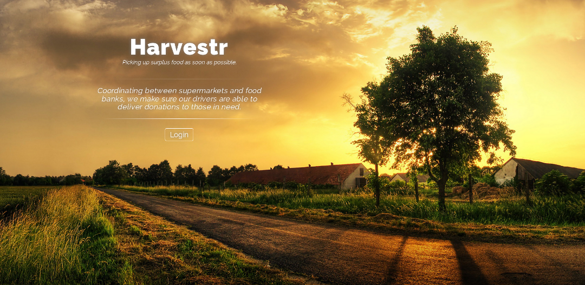
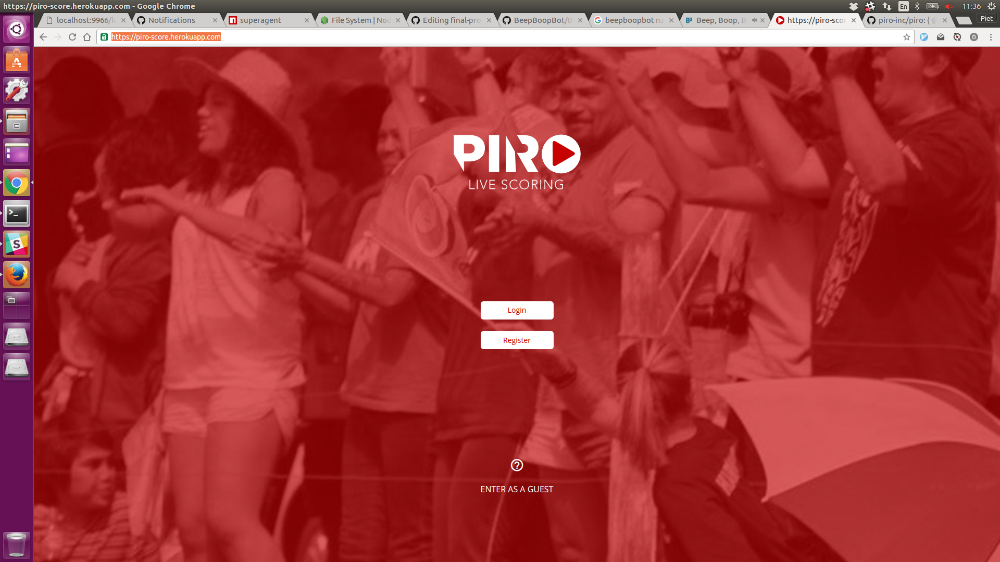
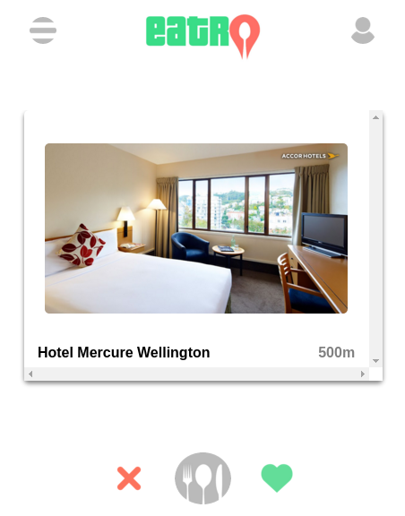
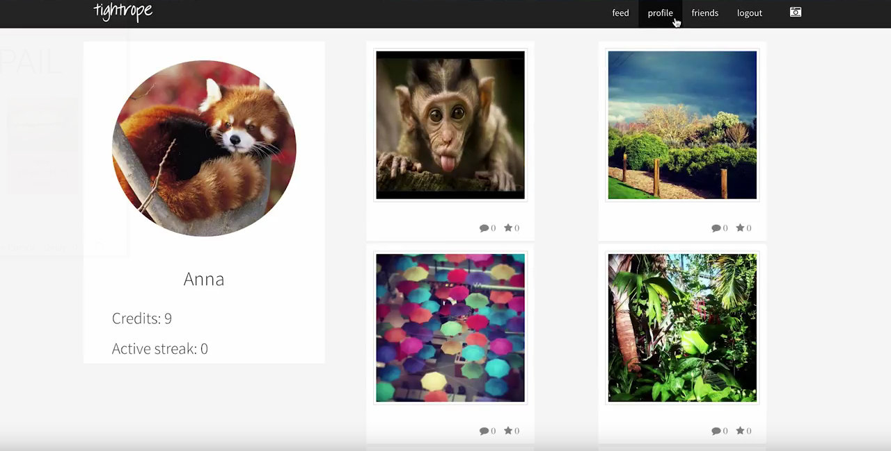

# Cohorts of 2016

Kowhai 2016
-----------

### [FlatMe](https://github.com/kowhai-2016/flatme)

A flat management app.

<!--  -->

* [GitHub Repository](https://github.com/kowhai-2016/flatme)

Weka 2016
---------

### 

<!-- description -->

<!--  -->

* [GitHub Repository](https://github.com/weka-2016/)

Piwakawaka 2016
---------------

### [Top of the Flops](https://topoftheflops.github.io/client-side/)

Sharing useless talents with the world.

* GitHub Repositories: [Backend](https://github.com/TopOfTheFlops/server-side) and [Frontend](https://github.com/TopOfTheFlops/client-side)

Kokako 2016
-----------

### 

<!-- description -->

<!--  -->

* [GitHub Repository](https://github.com/Kokako-2016/)

Kereru 2016
-----------

### 

<!-- description -->

<!--  -->

* [GitHub Repository](https://github.com/kereru-2016/)

Kahikatea 2016
--------------

### [Harvestr](http://harvestr.nz)

Coordinating the delivery of surplus food to organisations that need it.

* [GitHub Repository](https://github.com/kahikatea-2016/harvestr)

Nikau 2016
----------

### [Hashtag Adulting](http://www.hashtagadulting.co.nz)

The best curated videos on life skills for millenials.

* GitHub Repositories: [Backend](https://github.com/nikau-2016/lifestack) and [Frontend](https://github.com/nikau-2016/lifestack-client)

Kauri 2016
----------

### [Marak](https://www.marak.nz)

Connecting volunteers with local events.

* [GitHub Repository](https://github.com/kauri-2016/marak)

Kea 2016
--------

### [Beepboopbot](http://beepboopbot.com)

Game where you queue up commands for a robot to execute later. Save the world!

* [GitHub Repository](https://github.com/BeepBoopBot/BeepBoopBot)

### [Piro](https://piro-score.herokuapp.com/)

Publish and view live scores at sports events in real time.

* [GitHub Repository](https://github.com/piro-inc/piro)

Roa 2016
--------

### [Pitch In](http://pitch-in-nz.herokuapp.com)

Fast. Seamless. Connected. The New Standard for Volunteer Organisation.

* [GitHub Repository](https://github.com/AuxiliumRoa)

### [Eatr](https://eatr.herokuapp.com)

Tinder for eateries.

* [GitHub Repository](https://github.com/Eatr/eatr)

Kotare 2016
-----------

### [Tandem](https://github.com/Tandem-NZ/tandem)

Ride sharing app.

* [GitHub Repository](https://github.com/Tandem-NZ/tandem)

Hihi 2016
---------

### [onFleek](https://github.com/andrew-travis-wadman/TBD)

Social fashion hot or not.

* [GitHub Repository](https://github.com/andrew-travis-wadman/TBD)

### [Dish Out](https://github.com/James-Sangalli/DishOut)

Organise potlucks better.

* [GitHub Repository](https://github.com/James-Sangalli/DishOut)

### [Stow](https://github.com/rawad-alawar/stow) 

Airbnb for storage space.

* [GitHub Repository](https://github.com/rawad-alawar/stow)
 

Karearea 2016
-------------

### [CommsCompanian](https://github.com/melissa-c/Comms)

Assists autistic spectrum students to communicate visually.

* [GitHub Repository](https://github.com/melissa-c/Comms)

### [Trails](https://github.com/danieldelacruz01/trails)

Explore your city, time trial.

* [GitHub Repository](https://github.com/danieldelacruz01/trails)

Kakapo 2016
-----------

### [Tightrope](https://github.com/kakapo2016-projects/tightrope)

* [GitHub Repository](https://github.com/kakapo2016-projects/tightrope)
* [Final Presentation](https://www.youtube.com/watch?v=E8keq_d2u6U&feature=youtu.be)

### [Tooth & Pail](http://toothandpail.herokuapp.com/)

* [GitHub Repository](https://github.com/kakapo2016-projects/tooth-and-pail)
* [Final Presentation](https://www.youtube.com/watch?v=6amWNhbr9Hk&feature=youtu.be)
