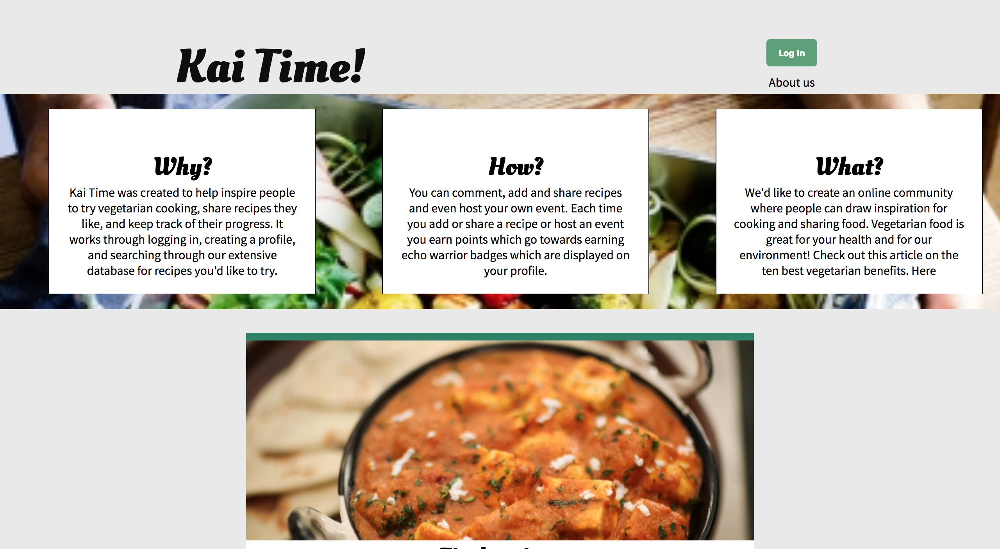
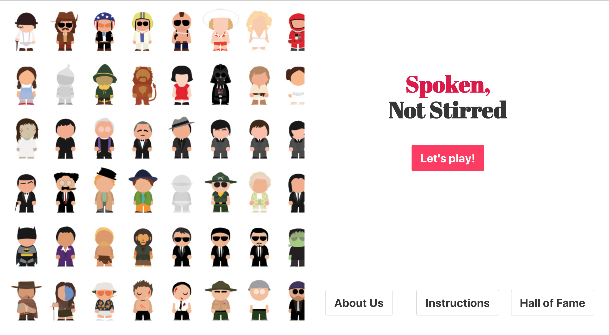
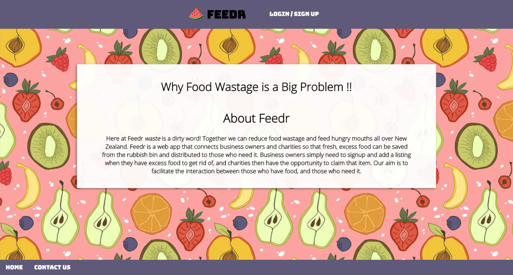
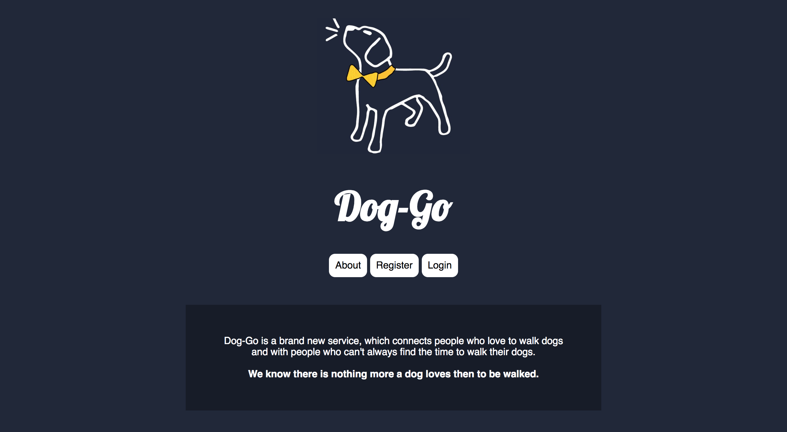
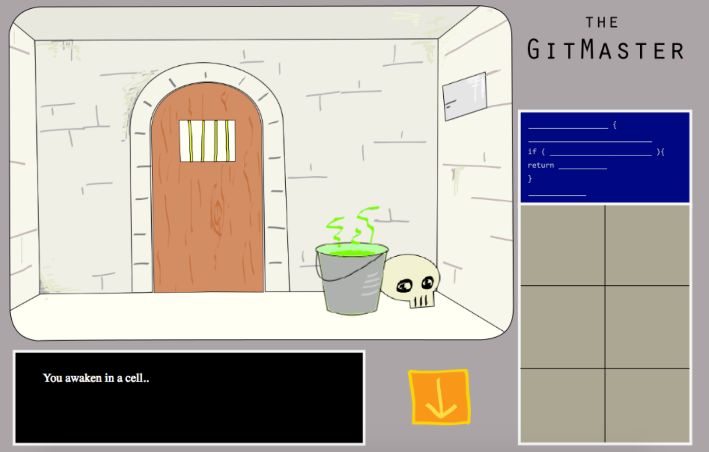
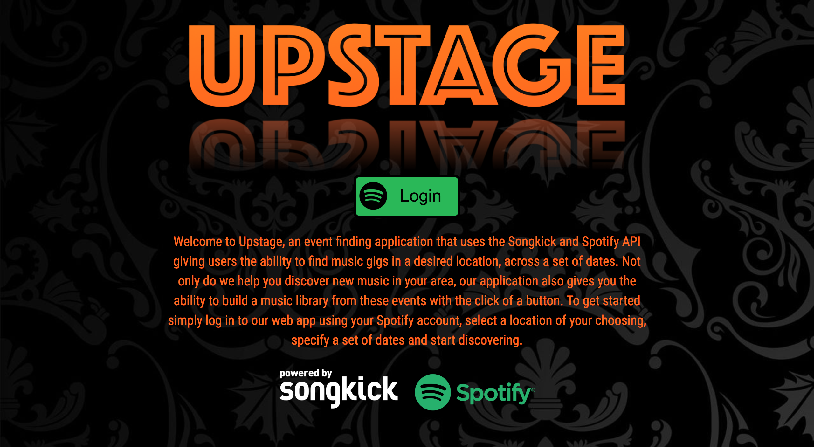
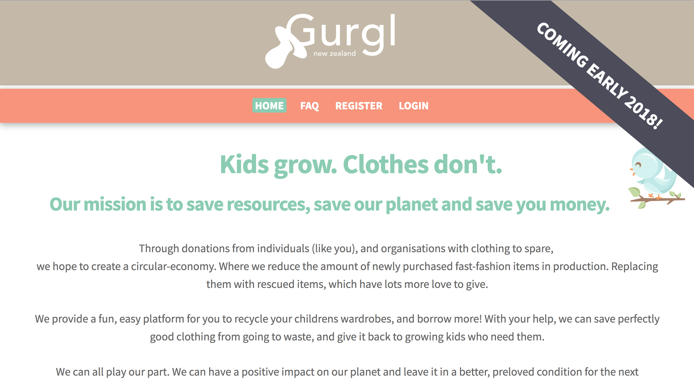
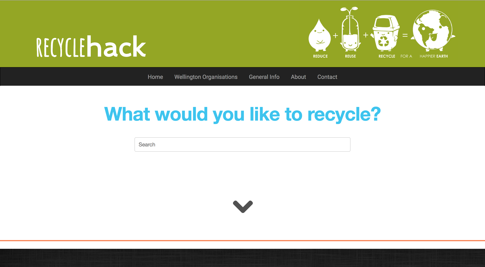

# Cohorts of 2017

| | Auckland | Wellington |
|---|---|---|
| 1 | [Horoeka](#horoeka-2017) | [Miromiro](#miromiro-2017)
| 2 | [Pohutukawa](#pohutukawa-2017) | [Kea](#kea-2017)
| 3 | [Matai](#matai-2017) | [Hihi](#hihi-2017)
| 4 | | [Kakapo](#kakapo-2017)

Miromiro 2017
-------------

### [Kai Time](https://github.com/Kai-Time/kai-time)

A place to promote vegetarian cooking and eating, where you can create a profile, and earn points by adding and sharing recipes.

* [GitHub Repository](https://github.com/Kai-Time/kai-time)

### [Spoken, not Stirred](https://miromiro-grad-project.herokuapp.com/)

It's time to see if you've got what it takes to foot it with your favourite movie stars, as they deliver some of the best one-liners of all time... This is the ultimate party game.

* [GitHub Repository](https://github.com/don-harris/final-project)

Horoeka 2017
------------

### [Feedr](https://github.com/james-inglis-01/feedr)

A web app built to help charities connect with businesses to provide food for those who need it, and reduce food waste.

* [GitHub Repository](https://github.com/james-inglis-01/feedr)

Kea 2017
--------

### [Dog Go](https://github.com/AnnahGerletti/dog-go)

The uber app for dog walkers.

* [GitHub Repository](https://github.com/AnnahGerletti/dog-go)

Pohutukawa 2017
---------------

### [Te Whare Piringa Booking](https://thebookingmanager.herokuapp.com/)

Booking app for Te Whare Piringa Community Centre.

* [GitHub Repository](https://github.com/Jae-Huh/te-whare-piringa-booking)

### [SkillHub](https://github.com/Sam-Houlahan/skillhub)

SkillHub is a community for people to share, discover and develop skills together. 

* [GitHub Repository](https://github.com/Sam-Houlahan/skillhub)

Hihi 2017
---------

### [GitMaster](https://github.com/pushmeproductions/gitmaster)

"It is the year 3000. Organic lifeforms battle for freedom against their robot overlords. The Version Control wars have been raging since before you were born. You are the last in the line of Gitmasters, and have been captured after your defeat in the most recent Merge Conflict. You awaken in a cell…"

Gitmaster is an interactive point and click adventure game that demonstrates the havoc that can be caused by pushing straight to master. The player must navigate through a series of different locations, collecting items and using them to solve small puzzles to win. The aim of the game is to blow up the React Core and exit the base in the Escape Pod.

* [GitHub Repository](https://github.com/pushmeproductions/gitmaster)

### [Upstage](http://up-stage.herokuapp.com/#/)

An awesome app that generates a Spotify playlist based on gigs you wanna checkout.

* [GitHub Repository](https://github.com/Giggify/Upstage)

### [Gurgl](https://github.com/EDA-Gurgl/gurgl)

Repurposing clothing for ever-growing kids.

* [GitHub Repository](https://github.com/EDA-Gurgl/gurgl)

### [RecycleHack](http://recyclehack.herokuapp.com/#/)

Making recycling easier for Wellingtonians.

* [GitHub Repository](https://github.com/sarah-due/TeamHoppers)

Matai 2017
----------

### [Bill's World](http://bills-world.herokuapp.com/)

This website enables users to vote and comment on government bills and legislation.

* [GitHub Repository](https://github.com/matai-2016/Bills-World)

