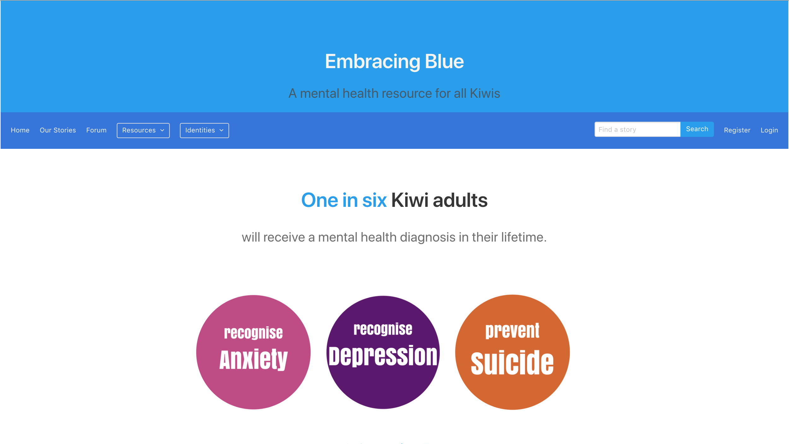
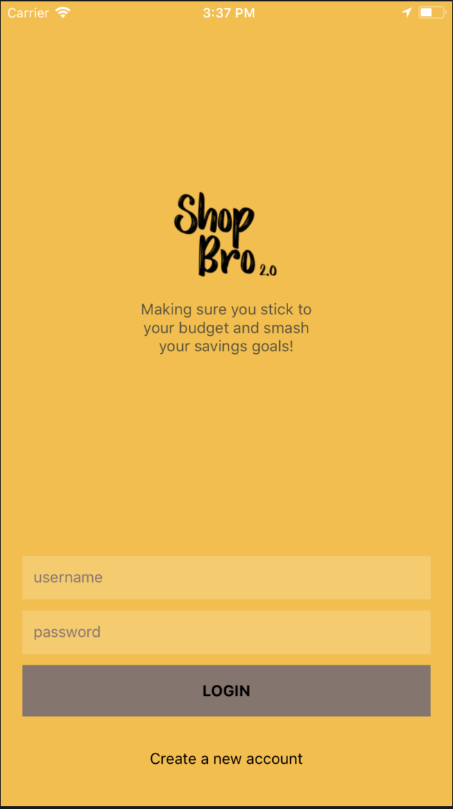
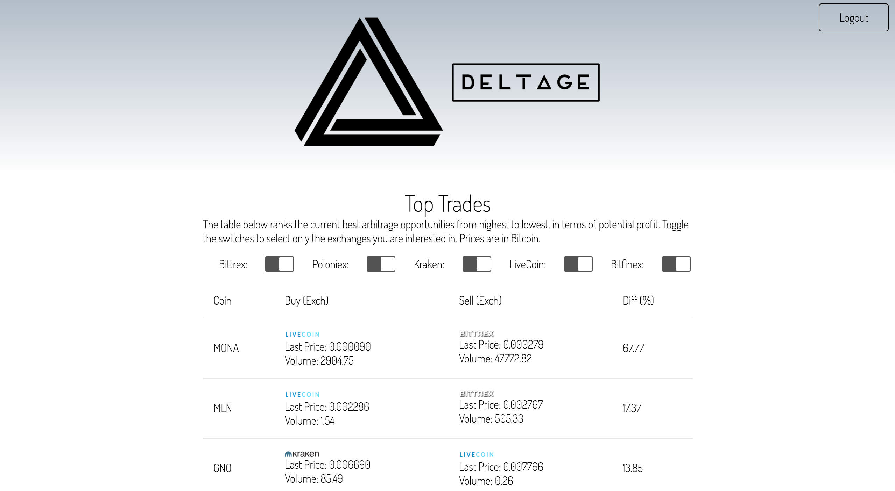

# Cohorts of 2018

Mamaku 2018
-----------

### [Meals 4 Mates]()

<!-- description -->

<!--  -->

* [GitHub Repository](https://github.com/mamaku-2018/Meals4Mates)

### [Emotional Map]()

<!-- description -->

<!--  -->

* [GitHub Repository](https://github.com/mamaku-2018/Emotional_Map)

Ruru 2018
---------

### [Persistance]()

<!-- description -->

<!--  -->

* [GitHub Repository](https://github.com/ruru-bootcamp-2018/Persistance)

Kauri 2018
----------

### [Pro Bono](http://pro-bono-test.herokuapp.com)

Pro-bono was created for the Auckland Community Law Centre to create better connections between Lawyers and pro-bono cases.

* [GitHub Repository](https://github.com/Kauri-2018/pro-bono)

### [Loyalty]()

A white label app for tracking customer loyalty to your business. Built in the case of Auckland Zoo and their Members of the Zoo loyalty club.

* GitHub Repository: [Web](https://github.com/Kauri-2018/loyalty-web) and [mobile](https://github.com/Kauri-2018/loyalty-app)

Kokako 2018
-----------

### [Embracing Blue](http://embracing-blue.herokuapp.com/)

Mental health resources for those affected and their communities.

* [GitHub Repository](https://github.com/Kokako-2018/Embracing-Blue)

<!-- ### [Shop Bro]()

<!-- description. -->

<!--  -->

<!-- * [GitHub Repository](https://github.com/Kokako-2018/shop-bro) --> 

Harakeke 2018
-------------

### [Marāma](http://http://www.marama.org.nz/)

Mārama is a centralised platform for study and funding opportunities available in Aotearoa.

* [GitHub Repository](https://github.com/Marama-App/marama.png)

### [DeltΔge](http://http://deltage.herokuapp.com/LiveApp)

A cryptocurrency tool to help find and act on arbitrage opportunities.

* [GitHub Repository](https://github.com/TylerGriffin99/Deltage/tree/deployment)

### [DRM](https://github.com/harakeke-2018/drm)

Managing essential resources such as food, water, shelter in different disaster centers.

* [GitHub Repository](https://github.com/harakeke-2018/drm)

<!-- Kahu 2018
---------

### 

description

* [GitHub Repository](https://github.com/kahu-2018/) -->
