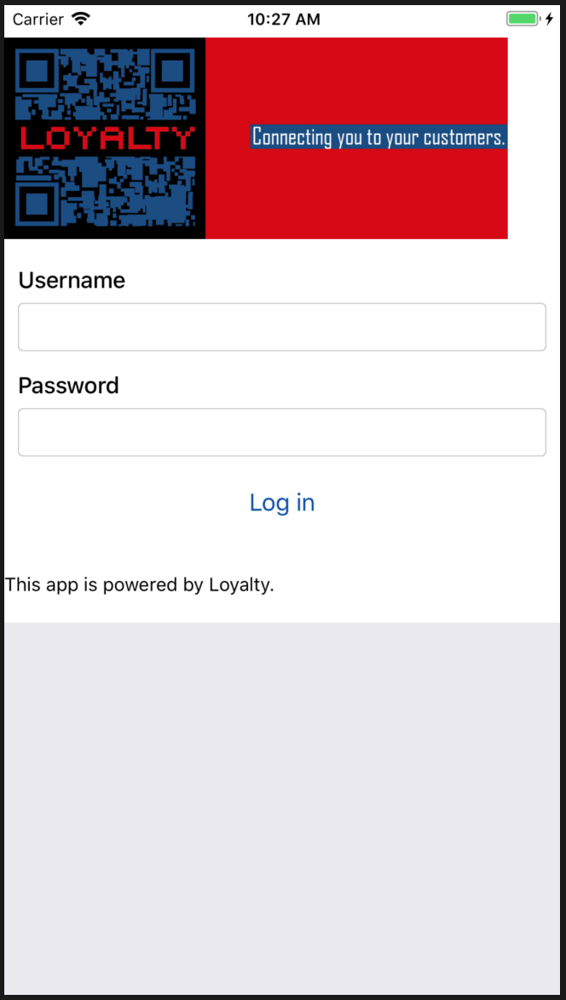

# Cohorts of 2018

Mamaku 2018
-----------

### 

<!-- description -->

<!--  -->

* [GitHub Repository](https://github.com/mamaku-2018/)

### 

<!-- description -->

<!--  -->

* [GitHub Repository](https://github.com/mamaku-2018/)

Ruru 2018
---------

### 

<!-- description -->

<!--  -->

* [GitHub Repository](https://github.com/ruru-2018/)

Kauri 2018
----------

### [Pro Bono](http://pro-bono-test.herokuapp.com)

Pro-bono was created for the Auckland Community Law Centre to create better connections between Lawyers and pro-bono cases.

* [GitHub Repository](https://github.com/Kauri-2018/pro-bono)

### [Loyalty]()

A white label app for tracking customer loyalty to your business. Built in the case of Auckland Zoo and their Members of the Zoo loyalty club.

* [GitHub Repository](https://github.com/Kauri-2018/loyalty-web)
* [GitHub Repository](https://github.com/Kauri-2018/loyalty-app)

Kokako 2018
-----------

### 

<!-- description -->

<!--  -->

* [GitHub Repository](https://github.com/kokako-2018/)

Harakeke 2018
-------------

### [Marāma](http://)

Mārama is a centralised platform for study and funding opportunities available in Aotearoa.

* [GitHub Repository](https://github.com/Marama-App/marama)

### [DeltΔge](http://)

A cryptocurrency tool to help find and act on arbitrage opportunities.

* [GitHub Repository](https://github.com/TylerGriffin99/Deltage/tree/deployment)

### [DRM](http://)

Managing essential resources such as food, water, shelter in different disaster centers.

* [GitHub Repository](https://github.com/harakeke-2018/drm)

Kahu 2018
---------

### 

<!-- description -->

<!--  -->

* [GitHub Repository](https://github.com/kahu-2018/)
