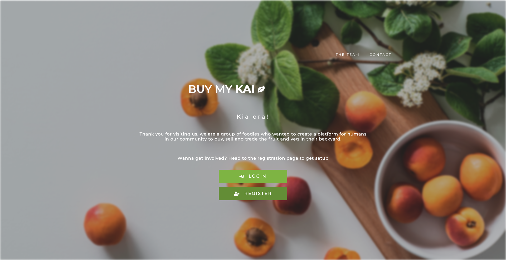
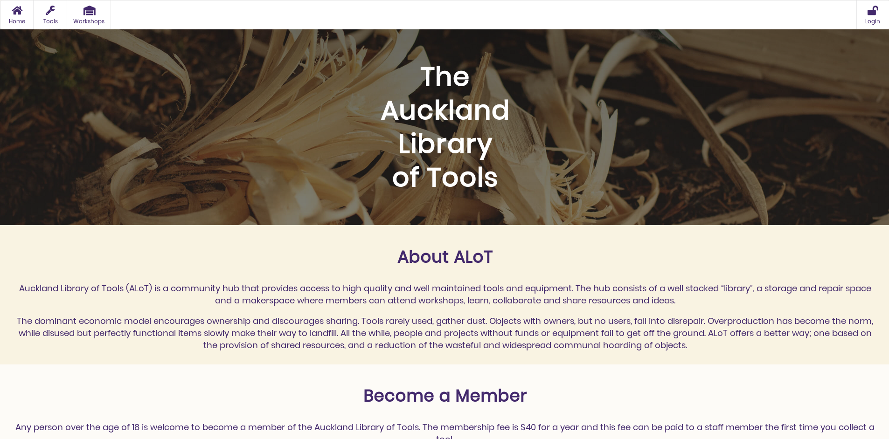
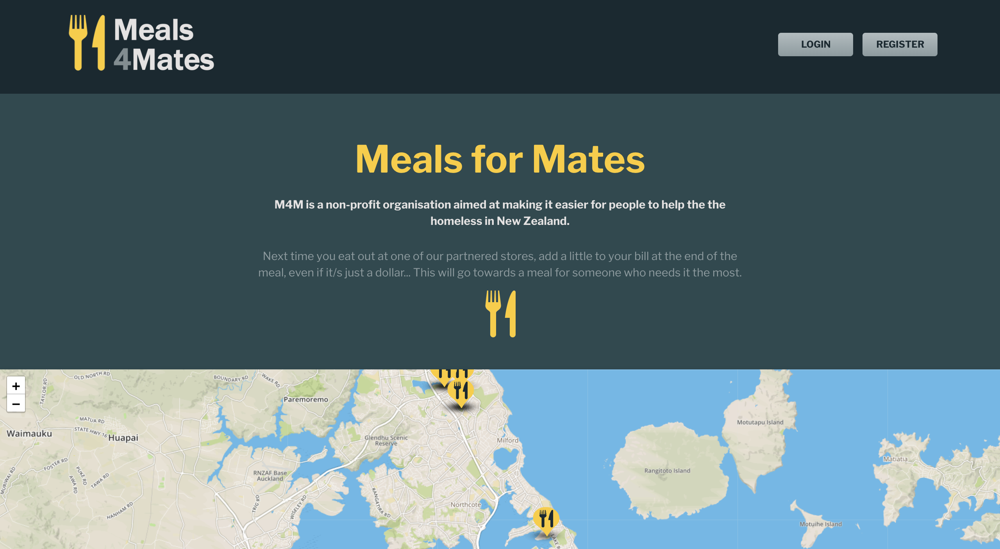
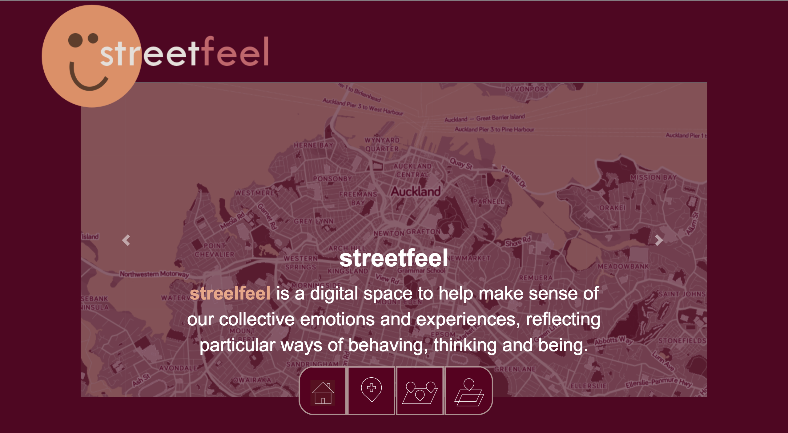
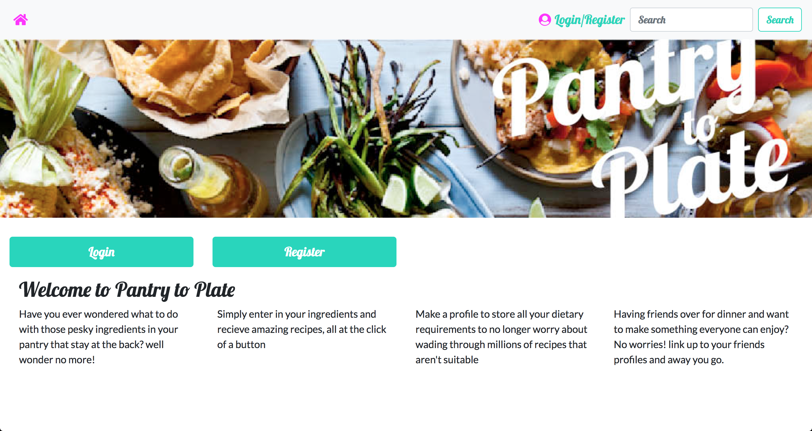

# Cohorts of 2018

| | Auckland | Wellington |
|---|---|---|
| 1 | [Nikau](#nikau-2018) | [Kahu](#kahu-2018)
| 2 | [Mamaku](#mamaku-2018) | [Ruru](#ruru-2018)
| 3 | [Kauri](#kauri-2018) | [Kokako](#kokako-2018)
| 4 | [Harakeke](#harakeke-2018) | [Kahu](#kahu-2018)

Nikau 2018
---------

### [Buy My Kai](https://github.com/nikau-2018/Buy-My-Kai)

Buy My Kai is a web app that connects people through the food we grow in our backyard. If you have a green thumb and would like to share your produce with the community you can sign up as a Grower and list what produce you would like to sell or trade.
If you're a foodie and on the hunt for local and fresh produce you can signup as an Eater and search for Growers in your neighbourhood.

Group members:
* Emma Ashley
* Lauren Hart
* Elizaveta Serous
* Zaine Kingi

[GitHub Repository](https://github.com/nikau-2018/Buy-My-Kai)

### [ALOT](https://alot.space/)

A community hub that provides access to tools, reduces unnecessary consumption and empowers people to build, share & create in a sustainable way.

Group members:
* James Built
* Aimee Coxhead
* George Hardy
* Tommy Hall
* Elisa Edwards

[GitHub Repository](https://github.com/nikau-2018/alot)

Mamaku 2018
-----------

### [Meals 4 Mates](http://meals4mates.herokuapp.com/#/)

M4M is a non-profit organisation aimed at making it easier for people to help the the homeless in New Zealand.

Group members:
* Anthony Xiao
* Sam 
* Cornelia Schultz
* Bronwyn Cotter
* Indigo Phillips

[GitHub Repository](https://github.com/mamaku-2018/Meals4Mates)

### [Streetfeel](http://streetfeel.herokuapp.com/#/)

Streelfeel is a digital space to help make sense of our collective emotions and experiences, reflecting particular ways of behaving, thinking and being.

Group members:
* Matt McGregor
* Michael Mitchell
* Caitlyn Bailey
* Rachael Peri
* Shane Park

[GitHub Repository](https://github.com/mamaku-2018/Emotional_Map)

Ruru 2018
---------

### [The Persistance](http://the-persistence.herokuapp.com/)

The Resistance is a game where players attempt to deduce one another's identities. The setting of the game is an imagined battle between a resistance group trying to overthrow the malignant government and the government spies infiltrating the resistance group.

<!-- Group members:
*  -->

[GitHub Repository](https://github.com/ruru-bootcamp-2018/Persistance)

Kauri 2018
----------

### [Pro Bono](http://pro-bono-test.herokuapp.com)

Pro-bono was created for the Auckland Community Law Centre to create better connections between Lawyers and pro-bono cases.

Group members:
* Cameron Probert
* Sarah McLaughlin
* Zoe Barron
* Kale Hembrow

[GitHub Repository](https://github.com/Kauri-2018/pro-bono)

### [Loyalty](https://github.com/Kauri-2018/loyalty-web)

A white label app for tracking customer loyalty to your business. Built in the case of Auckland Zoo and their Members of the Zoo loyalty club.

Group members:
* Frank Xu
* Zoe L
* Mayur R
* Victoria Kaihe

GitHub Repository: [Web](https://github.com/Kauri-2018/loyalty-web) and [Mobile](https://github.com/Kauri-2018/loyalty-app)

Kokako 2018
-----------

### [Embracing Blue](http://embracing-blue.herokuapp.com/)

Mental health resources for those affected and their communities.

<!-- Group members:
*  -->

[GitHub Repository](https://github.com/Kokako-2018/Embracing-Blue)

### [AR Atua](http://atua-web.herokuapp.com/)

AR Atua is an augmented reality app which places the god Tāwhirimātea on top of Mount Victoria. The web portion tells the legend of Tāwhirimātea, the background of our team, and helps transmit the spirit of the project by having a fully bilingual site where the english translations reveal themselves through active participation of the viewer. It is also built ontop of a database designed for translators.

<!-- Group members:
*  -->

[GitHub Repository](https://github.com/l-suzuki/atua-web)

### [Shop Bro](http://shopbro.herokuapp.com/#/)

Making sure you stick to your budget and smash your savings goals!

<!-- Group members:
*  -->

[GitHub Repository](https://github.com/Kokako-2018/ShopBro-2.0-mobile) 

Harakeke 2018
-------------

### [Marāma](http://www.marama.org.nz/)

Mārama is a centralised platform for study and funding opportunities available in Aotearoa.

Group members:
* Kristina Muller
* Emily Parkes
* Tian Du Toit
* Kimmi Rindel
* Catherine Fromont
* Elyse Wyatt

[GitHub Repository](https://github.com/harakeke-2018/marama)

### [DeltΔge](http://http://deltage.herokuapp.com/LiveApp)

A cryptocurrency tool to help find and act on arbitrage opportunities.

Group members:
* Tyler Griffin
* Tim Tolley
* Adam Kuhn
* Maddie Brighouse
* Peter Sim

[GitHub Repository](https://github.com/TylerGriffin99/Deltage/tree/deployment)

### [DRM](https://github.com/harakeke-2018/drm)

Managing essential resources such as food, water, shelter in different disaster centers.

Group members:
* Ethan Smith
* Judy Ting-Edwards
* Julia Niall
* Belma Gaukrodger

[GitHub Repository](https://github.com/harakeke-2018/drm)

Kahu 2018
---------

### [Pantry to Plate](http://pantry-to-plate.herokuapp.com/)

Have no energy to be creative enough to think of what to cook? Pantry to Plate is an app that could give you ideas and plan out meals around some of the food that needs to be eaten!

<!-- Group members:
*  -->

[GitHub Repository](https://github.com/kahu-2018/anything-but-a-pantry-manager)

