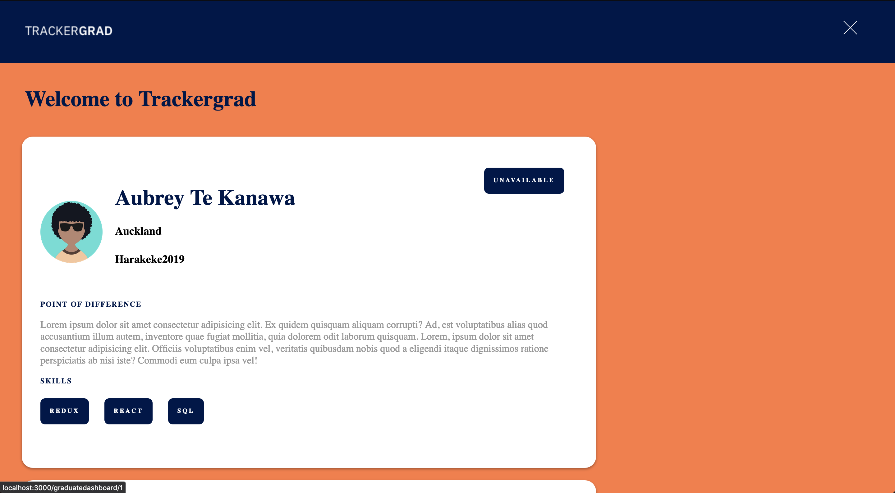
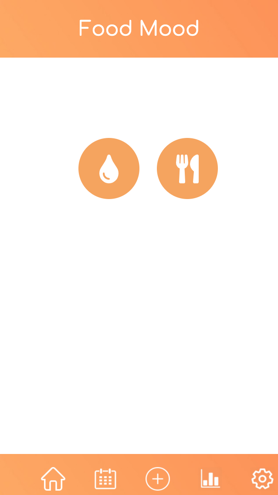
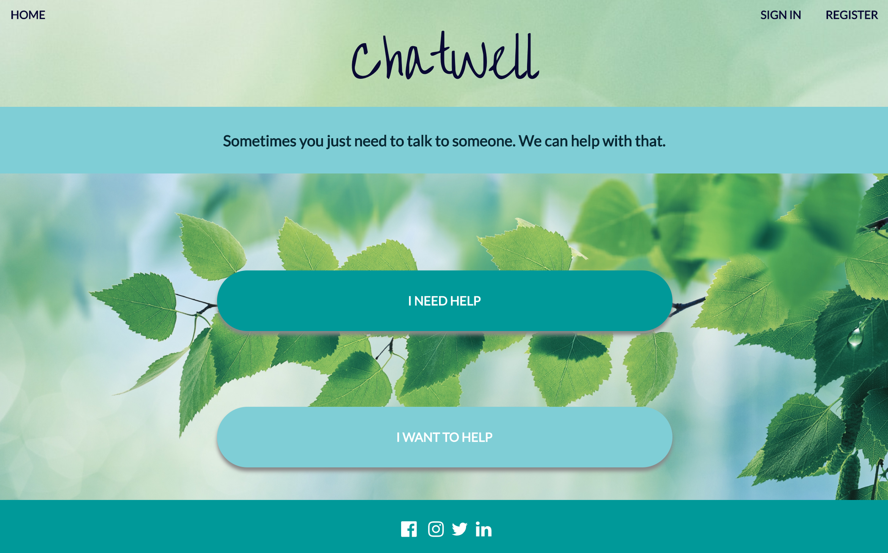
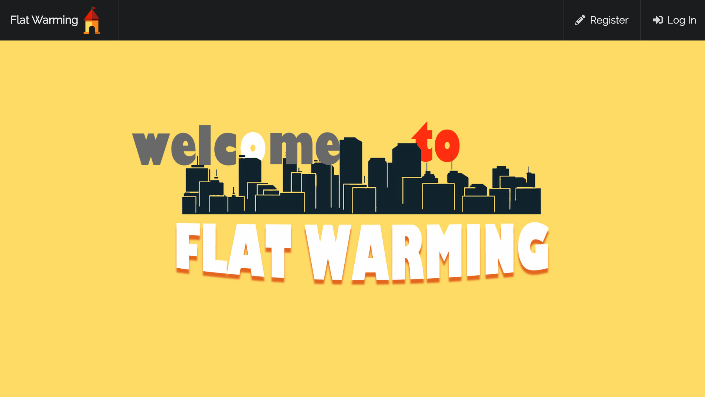
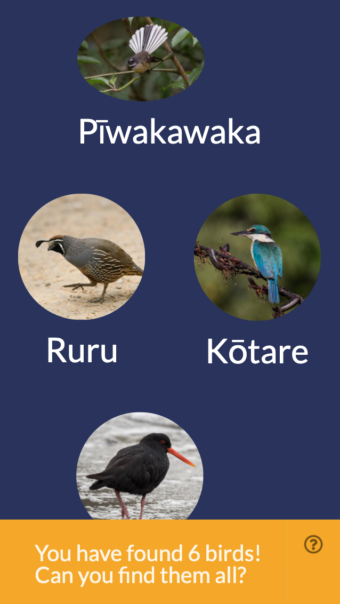
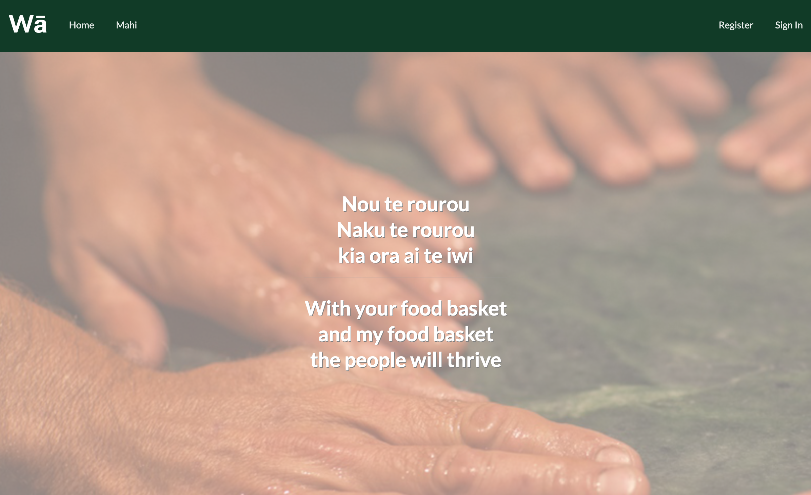

# Cohorts of 2019

| | Auckland | Wellington |
|---|---|---|
| 1 | [Harakeke](#harakeke-2019) | [Kahu](#kahu-2019)
| 2 | [Kahikatea](#kahikatea-2019) | [Piwakawaka](#piwakawaka-2019)
| 3 | [Matai](#matai-2019) | [Kotare](#kotare-2019)
| 4 | [Pohutukawa](#pohutukawa-2019) | [Roa](#roa-2019)
| 5 | [Horoeka](#horoeka-2019) | [Hihi](#hihi-2019)

Harakeke 2019
---------

### [Tracker Grad](https://github.com/harakeke-2019/track-a-grad)

 A web portal for Enspiral Dev Academy alumni to build CV profiles to advertise their job availability and enables employers to recruit from EDA, and allows EDA to facilitate the relationship.

Group members:
* Lane Le Prevost-Smith
* Aubrey Te Kanawa
* Evandah Steadman
* Jason Simpson
* Riki Hoeata

[GitHub Repository](https://github.com/harakeke-2019/track-a-grad)

### [FoodMood](https://github.com/harakeke-2019/food-mood)

FoodMood allows a user to record and monitor the impact certain foods has on not only their physical, but also their emotional state. It is a tool designed to assist any user to navigate their emotional relationship with food.

Group members:
* Jessica Morgan
* Francine Burling-Claridge
* Ari Thompson
* Ben Little
* Ngapeita Matehaere Leilua-Gotz

[GitHub Repository](https://github.com/harakeke-2019/food-mood)

### [Feke](https://github.com/harakeke-2019/feke)

Navigate learning vagahau Niue with your very own feke friend.

Group members:
* Rebecca Zhang
* Fetuolemoana Tamapeau
* Micah Peautagi
* Jenny Fang
* Grant Rigby

[GitHub Repository](https://github.com/harakeke-2019/feke)

Kahu 2019
---------
<!-- 
### [Name](https://github.com/)

description

Group members:
* 

[GitHub Repository](https://github.com/l)

 -->

Kahikatea 2019
---------

### [KidsKash](https://github.com/kahikatea-2019/kidskash)

Helping children learn about the importance of good decision making.

Group members:
* Bam Bam Bialostoki
* Ete
* Philip Ji

[GitHub Repository](https://github.com/kahikatea-2019/kidskash)

### [Spacey](https://github.com/kahikatea-2019/SPACEY-2.0)

A typical spaced repetition system.

Group members:
* Bradley Wheeler
* Ihaka Pink

[GitHub Repository](https://github.com/kahikatea-2019/SPACEY-2.0)

Piwakawaka 2019
---------
<!-- 
### [Name](https://github.com/)

description

Group members:
* 

[GitHub Repository](https://github.com/l)

 -->

Matai 2019
---------
<!-- 
### [Name](https://github.com/)

description

Group members:
* 

[GitHub Repository](https://github.com/l)

 -->

Kotare 2019
---------
<!-- 
### [Name](https://github.com/)

description

Group members:
* 

[GitHub Repository](https://github.com/l)

 -->

Pohutukawa 2019
---------
### [ChatWell](https://github.com/pohutukawa-2019/ChatWell)

Sometimes you just need to talk to someone. We can help with that.

Group members:
* Iris Riddell
* Michael Hodges
* Marvin Coronel
* Katrina Turner
* Henry Peti
* Raemon Matene

[GitHub Repository](https://github.com/pohutukawa-2019/ChatWell)

### [BucketBook](https://github.com/pohutukawa-2019/BucketBook)

Bucket Book is a travel based bucket list app that aims to help you achieve your travel goals.

Group members:
* Sam Bowering
* Jeremy Magill
* James Wylie
* Angela Yang
* James Sanday
* Nikolai Talamahina

[GitHub Repository](https://github.com/pohutukawa-2019/BucketBook)

Roa 2019
---------
<!-- 
### [Name](https://github.com/)

description

Group members:
* 

[GitHub Repository](https://github.com/l)

 -->

Horoeka 2019
---------
### [FlatWarming](https://github.com/horoeka-2019/flatwarming)

For too long tenants have had a bad rep. Lets change that.\
By consolidating all the flat admin into one easy to access location, we hope to mend the reputation of tenants, and create a better relationship between tenants and landlords.

Group members:
* Jackie Shu
* Sunny Niu
* Eloise McIntyre
* Ashleigh Ah Ta

[GitHub Repository](https://github.com/horoeka-2019/flatwarming)

### [He Pokai-Manu](https://github.com/horoeka-2019/Manu)

He Pokai-Manu is a treasure-hunt game for birds in Aotearoa. We aim to help younger Kiwis learn more about our bird life in an exciting way, while getting them outside and interested in nature.

Group members:
* Jill Glass
* Roman Mitch
* Adam Cowie
* Peter Robinson

[GitHub Repository](https://github.com/horoeka-2019/Manu)

### [Wā](https://github.com/horoeka-2019/Wa)

Wā uses Mahi to facilitate the give and take between people in the community — members exchange wā/time when a mahi is offered or completed. Wā is a community-based platform where you can xchange the gift of time with people in your community, aiming to build strong connections between people. Become more aware of the skills you have and what you can offer and discover what people around you can offer in return. 

Group members:
* Andria Hibe
* Jeya Raniga
* Suzana Melo Moares
* Marina Tateoka
* Te-Piha Niha
* Samuel Looi

[GitHub Repository](https://github.com/horoeka-2019/Wa)

Hihi 2019
---------

### [Foraged and Found]()

<!-- description  -->

Group members:
* Freya Davies
* Sophie Scott-Maunder
* Vere Tindale
* Richard Han
* Edgars Avenins
* Caitlin Potter
* Nisida Azzalini

<!-- [GitHub Repository](https://github.com/l)

 -->

### [Quizzical]()

<!-- description  -->

Group members:
* Cass Guinut 
* Cherise Tan
* Ethan O'Brien
* Fraser Callum

<!-- [GitHub Repository](https://github.com/l)

 -->

### [Splinter]()

Keeping track of group expenditures can be tough and awkward.
This is an app that helps to track spending and divide and settle the bills.

Group members:
* Bas Suckling
* Alice Alsford 
* Tosca Wilson
* Robert Cummins

[GitHub Repository](https://github.com/hihi-2019/splinter)

