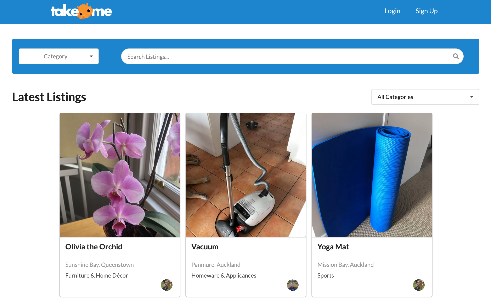
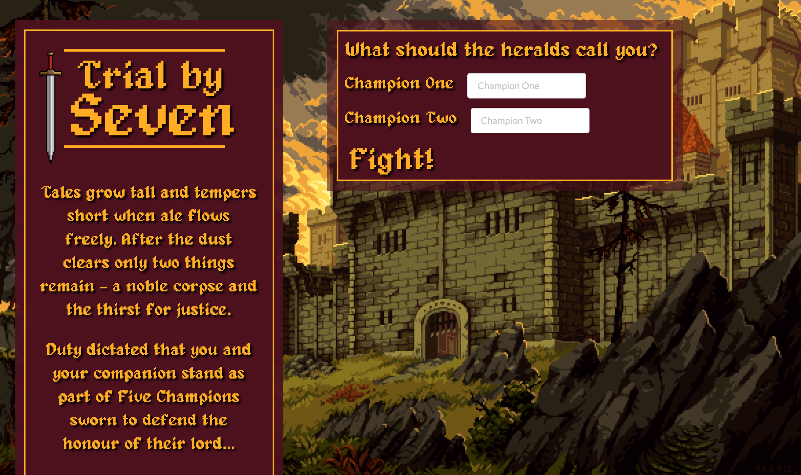
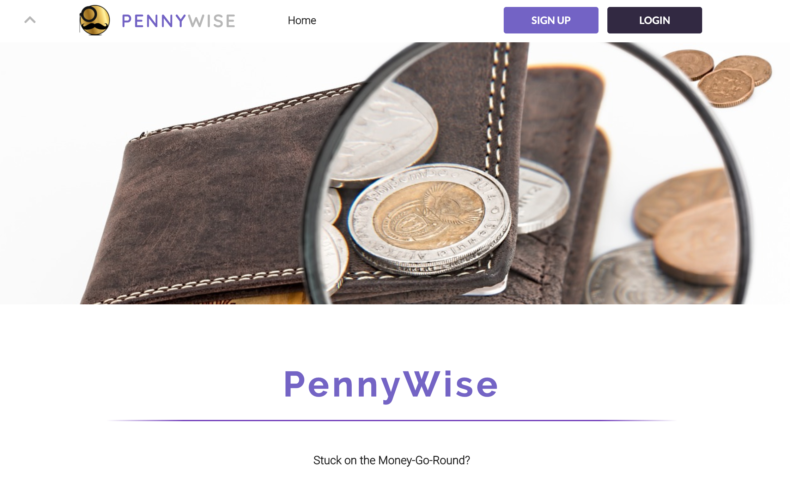
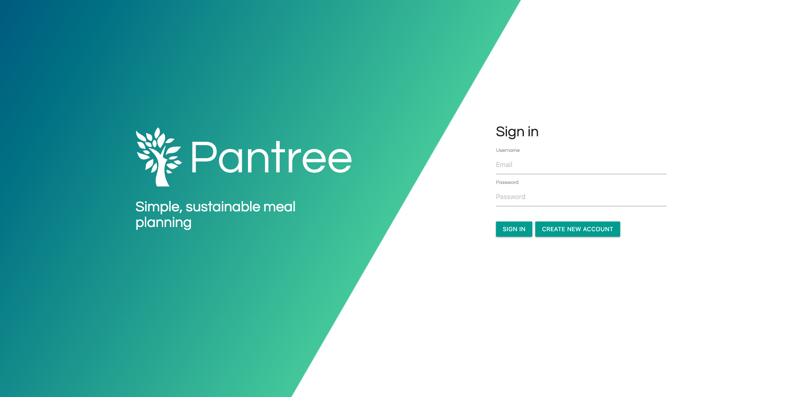
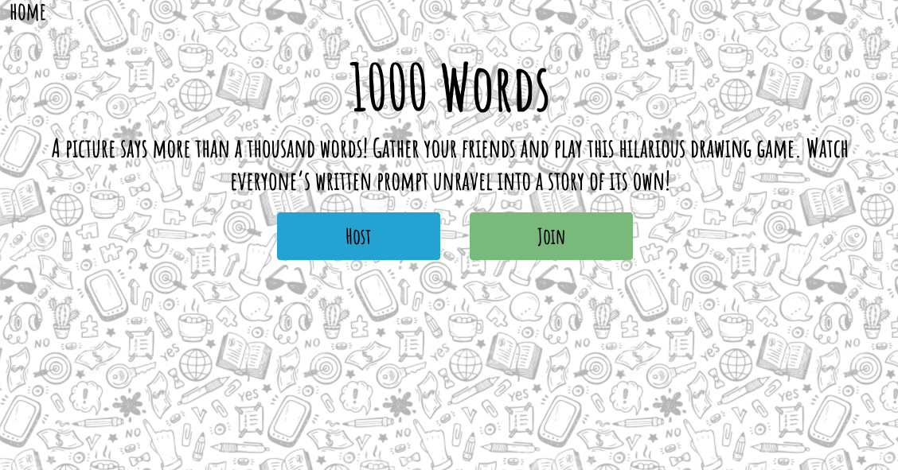
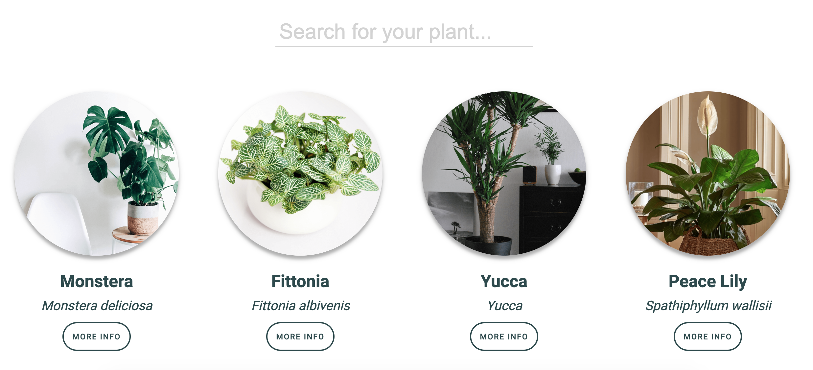
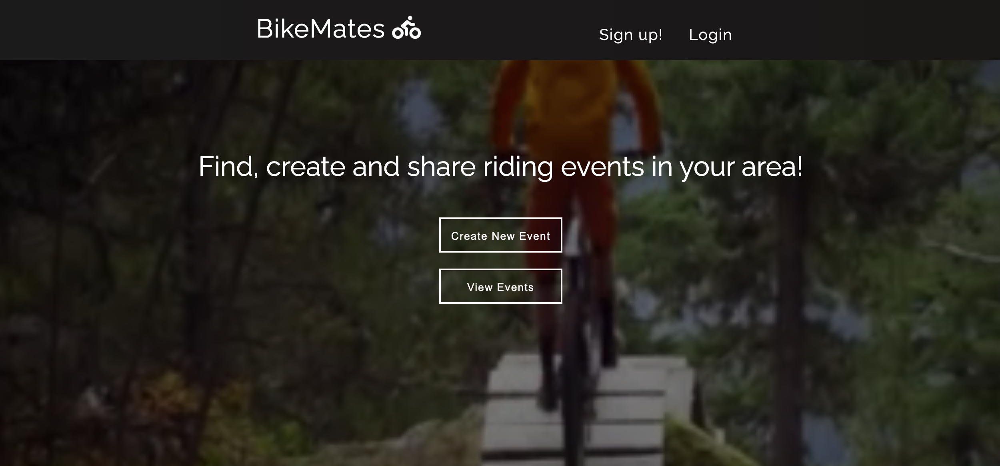

# Cohorts of 2020

| | Auckland | Wellington | Online
|---|---|---|
| 1    | [Harakeke](#harakeke-2020)   | [Kahu](#kahu-2019)             |
| 2    | [Kahikatea](#kahikatea-2020) | [Piwakawaka](#piwakawaka-2020) |
| 3    | <!--[Matai](#matai-2020) -->  | [Kotare](#kotare-2020)         |
| 4    | <!--[Pohutukawa](#pohutukawa-2020)--> |<!--[Roa](#roa-2020)--> | [Manaia](#manaia-2020)
| 5    | <!--[Horoeka](#horoeka-2020) -->    | [Hihi](#hihi-2020)       | [Aihi](#aihi-2020)   

Harakeke 2020
-----------

### [Be Seasonable](https://beseasonable.com/)

Be Seasonable is an app that helps people make sustainable food choices by making it easy to see what is in season, at low prices and other ethical concerns. Be Seasonable is a free website that tells you what produce is currently in season, the average monthly cost based on the Statistics NZ Food Price Index, and any ethical warnings we've identified for that produce.

It does this by combining the average monthly costs of in-season produce with research into the environmental and ethical impacts of production.

Group members:
* Nat Dudley
* Qianye Lin
* Lorenzo Fernandez
* Brendan Olphert
* Hywel Thomas

[GitHub Repository](https://github.com/harakeke-2020/Final-Project-Be-Seasonable)

<!-- 
Kahu 2020
--------- -->

Kahikatea 2020
---------

### [TakeMe](https://take-me-nz.herokuapp.com)

This is a web app for listing items that you no longer want or need, but could still have value or use to someone else. The focus is on recycling, preventing both waste and further unnecessary production, with a side effect of saving you money!

Group members:
* Pat Lim
* Laché Melvin
* Ellora Virtue
* Hamish Tana
* Mathias Bast
* John Sengson

[GitHub Repository](https://github.com/kahikatea-2020/take-me)

### [Trial by Seven](https://the-name-of-the-game.herokuapp.com/)

Tales grow tall and tempers short when ale flows freely. After the dust clears only two things remain - a noble corpse and the thirst for justice.\
Duty dictated that you and your companion stand as part of Five Champions sworn to defend the honour of their lord.\
Cruel fate, that it be on opposing sides of the field...

Group members:
* Karel Fourie
* Matthew Kalopulu
* Stan Gogan
* Tom Clayton
* Alicia Lu

[GitHub Repository](https://github.com/kahikatea-2020/The-Name-Of-The-Game)

### [PennyWise](https://pennywise-eda.herokuapp.com/#/)

Stuck on the Money-Go-Round? Bring your money and budgeting back in balance.

Group members:
* Matthew Uy
* Jimmi Meredith
* Lucas Santana
* David Dumolo
* Chris Alba
* Raymond Leung

[GitHub Repository](https://github.com/malyz01/pennyWise)

<!-- 
Piwakawaka 2020
--------- -->

## Kōtare 2020

### [Pantree](https://pantree-app.herokuapp.com/)

🌱 Pantree is a simple meal planner app with a focus on sustainability and connecting users to locally sourced ingredients.

Group members:
* Aisyah Tajudin
* Ben Means
* Fai Songprasit
* Jefferson Matumba
* Joe Butler
* Rose Mead

[GitHub Repository](https://github.com/kotare-2020/Pantree)

### [Cheeky Road Trip]()

Keen for a cheeky roadie? Here's an app for planning a roadtrip and finding toilet stops (and other attractions) along the way. Developed using mapbox.

Group members:
* Derek Butler
* Ben Irvine
* George Staniland
* Richard Emanuel

[GitHub Repository](https://github.com/kotare-2020/Cheeky-Road-Trip)

### [1000 words](https://one-thousand-words-game.herokuapp.com/#/)

1000 words

An interactive game where players draw what another player has described in words. Resulting in hilarious outcomes similar to chinese whispers. Developed using web sockets.

Group members:
* Andrew Tempany
* Marta Machura
* Jayden Hall
* Rubin Gower
* Nick Jarvie

[GitHub Repository](https://github.com/kotare-2020/1000-words)

## Hihi 2020

### [Not-uni](http://not-uni.herokuapp.com/)

Streamlining the creation and consumption of opensource information.

Group members:
* Oli Clive-Griffin
* Matt Strawbridge
* Olivia Gambitsis
* Corian Youdale
* Robbie Hamilton

[GitHub Repository](https://github.com/hihi-2020/Not-Uni)

### [Leaf it to me](http://leaf-it-to-me.herokuapp.com/)

Helping house plant owners make their plants feel like bliss. An app to track and care for your house plants.

Group members:
* Emily Berryman
* Hortense Rothery
* Orlando Bright
* Ian Montgomery
* Saskia Lein
* Jess Veng
* Jesse Hutt

[GitHub Repository](https://github.com/hihi-2020/Leaf-it-to-me)

### [Bike race](http://bike-mates.herokuapp.com/)

An app for planning bike races.

Group members:
* Phillip Wood
* Alex Shatskiy
* Gareth Wright
* Manu Canadas
* Matt Blackbourn
* Adam Macken

[GitHub Repository](https://github.com/hihi-2020/bike-race)

