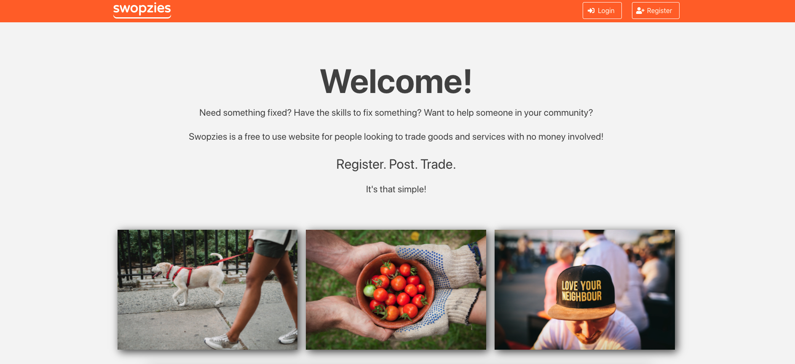
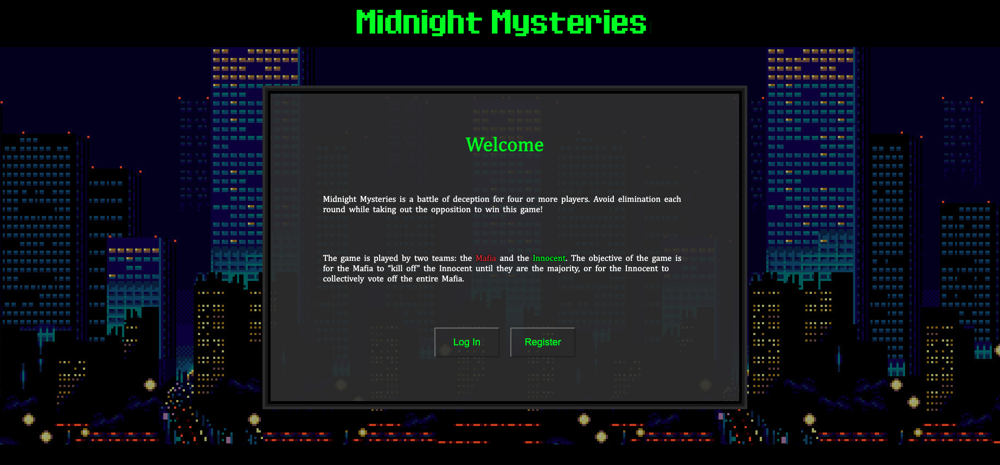
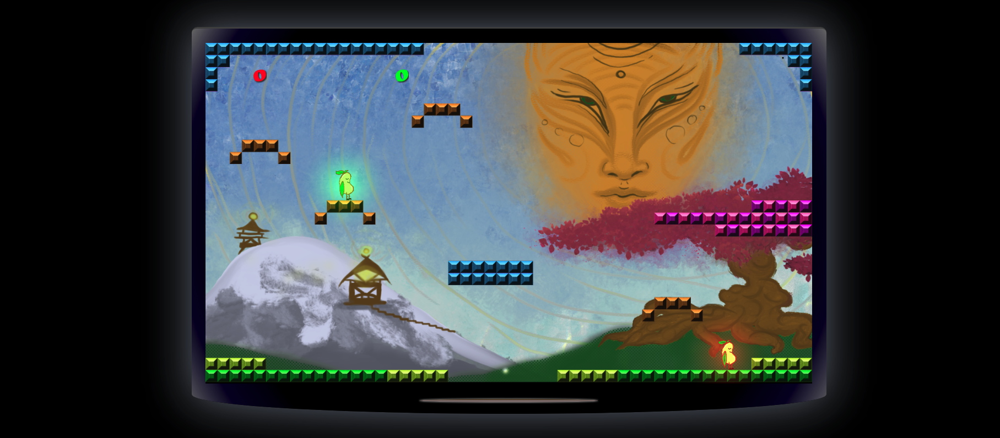

# Cohorts of 2021

|     | Auckland                              | Wellington                            | Online                         |
| --- | ------------------------------------- | ------------------------------------- | ------------------------------ |
| 1   | <!--[Harakeke](#harakeke-2021) -->    | [Kahu](#kahu-2021)                    |                                |
| 2   | <!--[Kahikatea](#kahikatea-2021) -->  | [Piwakawaka](#piwakawaka-2021)        |                                |
| 3   | <!--[Matai](#matai-2021) -->          | [Kōtare](#kōtare-2021)                |                                |
| 4   | <!--[Pohutukawa](#pohutukawa-2021)--> | <!--[Roa](#roa-2021) -->              | <!-- [Manaia](#manaia-2021)--> |
| 5   | <!--[Horoeka](#horoeka-2021) -->      | <!--[Hihi](#hihi-2021) -->            | <!--[Aihi](#aihi-2021)-->      |

Kahu 2021
-----------

### [Swopsies](https://swopzies.herokuapp.com/#/)

Goods and services are expensive... why not offer a way for the community to come together and trade skills, knowledge and home baked goods.

This is an app for people to list goods and services that they need, or want to share within their community. It is aimed at people of all demographics, whether it's someone who is retired and offering their services in their spare time, or a busy young professional wanting someone to walk their dog.

The hope is to provide a platform for people who are wanting to trade their skills and crafts, but don't have money in mind while doing so. Who doesn't like a good old barter??

Group members:

- Jack
- Lara
- Mike
- Naomi
- Rob
- Julia
- Rosemary

[GitHub Repository](https://github.com/kahu-2021/jack-of-all-trades)

### Glasshouse

A project to give power back to tenants! Our site allows users to search rental properties and add reviews based on the condition of their home. Inspired by Glassdoor company reviews.

Group members:

- Isaac
- Jeff
- Logan
- Lukas
- Tom
- Stephen
- Samardeep

[GitHub Repository](https://github.com/kahu-2021/glassHouse)

<!--  -->

Piwakawaka 2021
-----------

### Rank

An app to locate and review public toilets. Built using mapbox.

Group members:

- Leah
- Fliss
- Dianne
- Seb
- Joon

[GitHub Repository](https://github.com/piwakawaka-2021/RANK)

<!--  -->

### [Midnight Mysteries](https://midnight-mysteries.herokuapp.com/)

Midnight Mysteries is a battle of deception for four or more players. Avoid elimination each round while taking out the opposition to win this game!
The game is played by two teams: the Mafia and the Innocent. The objective of the game is for the Mafia to “kill off” the Innocent until they are the majority, or for the Innocent to collectively vote off the entire Mafia.

Group members:

- David
- Jack
- Alex
- Louis
- Marni
- Keane
- Kafele
- Elwin

[GitHub Repository](https://github.com/piwakawaka-2021/web-socket-mafia)

Kōtare 2021
-----------

### Phaser Playground

A collection of platform style games built using phaser.

Group members:

- Tom
- Fred
- Megan
- Ymmij
- Casey

[GitHub Repository](https://github.com/kotare-2021/phaser-playground)

<!--  -->

### Scale

An app for recreational fishers to record their catch, get weather data, and ultimately to build a dataset to monitor and maintain levels of fish species.

Group members:

- Karen
- Anastasia
- Silvia
- James
- Saula
- Yousuf

[GitHub Repository](https://github.com/kotare-2021/Scale)

<!--  -->

### [Bean Brawl](http://beanbrawl.herokuapp.com/)

Experience up to 4 player local multiplayer action, with gamepad (xbox & playstation) support. Bean Brawl is a 2d action fighting game with simple rock-paper-scissors-like mechanics. Each bean brawler can change their stance, affecting their movement. Gameplay rewards quick reaction times and fast, controlled player movement.

Group members:

- Edwyn
- Sam
- Ben
- Lucas
- Taine
- Ricki-Jane
- Harriet

[GitHub Repository](https://github.com/kotare-2021/dbb-ii)

